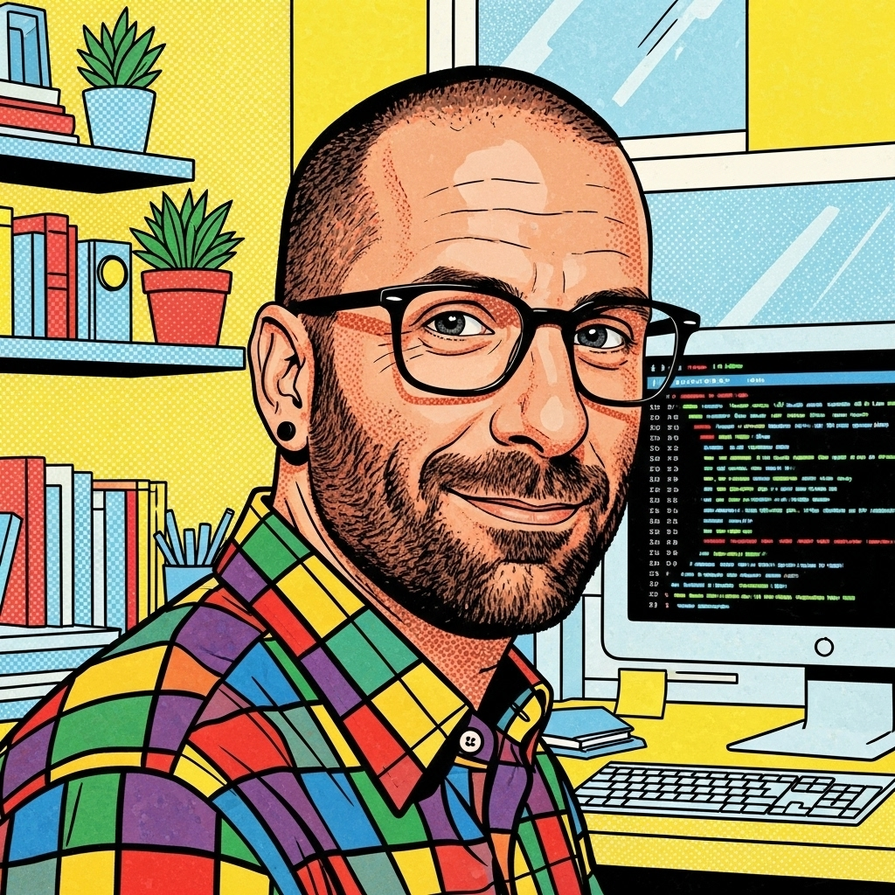

# Matthew Martz, PhD

  
  <h1>Matthew Martz, PhD</h1>
  

    Data Science & AI Leader | Clinical AI Innovator | Director of ML/AI Strategy
  

  

    Expert in building and leading teams of Data Scientists, Machine Learning Engineers,
    and Data Product experts to drive innovation, product development, and cutting-edge research.
  

  

    <a href="about/" class="cta-button">Learn More About Me</a>
    <a href="projects/" class="cta-button secondary">View Project Portfolio</a>
  

## Current Research Focus

I'm pioneering the development of **comprehensive healthcare AI platforms** that transform the largest untapped opportunity in modern medicine—the billions of patient interactions and outcomes locked in fragmented systems.

**My Platform Addresses Healthcare's Core Challenge**: Less than 3% of healthcare's 2.5 exabytes of daily data is used for predictive analytics, representing massive underutilization that could revolutionize patient care.

**What I've Built**:

- **2.3 million patient knowledge graph** demonstrating scalable AI platform capabilities
- **Privacy-preserving federated learning** enabling multi-site collaboration without data sharing
- **Clinical workflow integration** with 15+ interfaces and 100+ service methods
- **Patient digital twins** for precision medicine at population scale

!!! research "Healthcare AI Platform Innovation"
    Currently developing advanced algorithms that integrate clinical, genomic, and pathway data to create comprehensive **patient digital twins** for transformative clinical impact. This work combines 17 years of production ML/AI experience with deep clinical domain expertise.

[**Learn More About My Healthcare AI Research →**](research.md){ .md-button .md-button--primary }

## Professional Highlights

  

    <h4>🎯 Leadership Experience</h4>
    

      17+ years Data Science/ML/AI
      8+ years Director/VP level
      25+ member teams
      Strategy & Vision
    

  

  

    <h4>🧬 AI Platform Architecture</h4>
    

      Graph Neural Networks
      Agentic Knowledge Systems
      Patient Digital Twins
      Multimodal AI Integration
      Privacy-Preserving ML
    

  

  

    <h4>🚀 Production Scale Achievements</h4>
    

      2.3M Patient Knowledge Graph
      400M+ Graph Relationships
      Billion+ Parameter Models Live
      Sub-millisecond Inference
      5 Awarded Patents
    

  

  

    <h4>💻 Production Technical Stack</h4>
    

      PyTorch Geometric GNNs
      Neo4j 5.x Graph Database
      CUDA Multi-GPU Training
      Real-time ML APIs (ms latency)
      Federated Learning & Privacy
      Clinical AI Frameworks
    

  

## Latest News & Updates

!!! info "Recent Highlight"
    **New Post!** [Summer of AI - An AgBiome Perspective](blog/posts/2023/11/09/summer_of_AI.md) - An interview discussing Artificial Intelligence from an industry perspective.

---

## Current Position

  <h3>Creator and Team Leader - Agentic Knowledge Engine</h3>
  
Mayo Clinic, Rochester, MN

  
2024 - Present

  Leading development of a cutting-edge, robust data platform engineered for multi-modal data that integrates seamlessly with diverse databases and data lakes, facilitating real-time ingestion into sophisticated knowledge graphs.

  **Key Achievements:**

  - Developing proprietary algorithms for multi-modal data processing
  - Creating and refining knowledge graphs enhanced by advanced AI-driven data processing
  - Building intelligent agents and toolchains for complex question-answering flows
  - Developing robust execution graphs for advanced agentic capabilities

---

## Mission Statement

> My collective experience in advanced AI, knowledge graph development, and multimodal modeling is strategically directed towards pioneering the creation of **comprehensive patient digital twins** for transformative impact in both clinical practice and research.

I am passionate about revolutionizing predictive healthcare through the strategic integration of cutting-edge AI methodologies, with a strong emphasis on clinical implementation that ensures theoretical advancements translate into tangible improvements in patient care.

---

## Connect With Me

Ready to discuss AI innovation, clinical applications, or potential collaborations?

  

    
📧

    <a href="mailto:matthew@mutaku.io">Email</a>
  

  

    
💼

    <a href="https://linkedin.com/in/matthew-martz-phd">LinkedIn</a>
  

  

    
🐦

    <a href="https://twitter.com/backpropagating">Twitter</a>
  

  

    
💻

    <a href="https://github.com/mutaku">GitHub</a>
  

